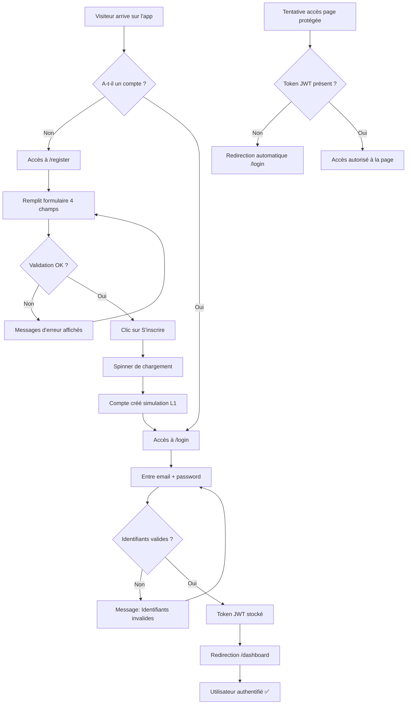

# Parcours Utilisateur Non Authentifié

## 📋 Introduction

Un utilisateur **non authentifié** (ou visiteur) est une personne qui accède à l'application UQO-Requests **sans être connectée**. 

Ce document décrit :
- Les pages accessibles sans connexion
- Le processus d'inscription
- Le processus de connexion  
- Les restrictions d'accès
- Les redirections automatiques

---

## 🌐 Pages Accessibles Sans Connexion

Un visiteur peut accéder à **2 pages uniquement** :

### 1. Page de connexion (`/login`)

**URL :** `http://localhost:5173/login`

**Description :** Permet à un utilisateur existant de se connecter.

**Accès possible via :**
- URL directe (taper dans le navigateur)
- Lien depuis la page d'inscription
- Redirection automatique si tentative d'accès à page protégée

**Fonctionnalités :**
- Formulaire avec 2 champs :
  - Email (format valide requis)
  - Mot de passe (minimum 8 caractères)
- Bouton "Se connecter"
- Lien vers page d'inscription
- Validation en temps réel
- Messages d'erreur si identifiants invalides

---

### 2. Page d'inscription (`/register`)

**URL :** `http://localhost:5173/register`

**Description :** Permet à un nouveau visiteur de créer un compte.

**Accès possible via :**
- URL directe
- Lien depuis la page de connexion

**Fonctionnalités :**
- Formulaire avec 4 champs :
  - Nom complet (3-150 caractères)
  - Email (format valide)
  - Mot de passe (8+ caractères, 1 majuscule, 1 chiffre)
  - Confirmation mot de passe (doit correspondre)
- Bouton "S'inscrire" (désactivé si formulaire invalide)
- Lien vers page de connexion
- Validation en temps réel
- Messages d'erreur sous chaque champ

---

## 🔐 Processus d'Inscription (Étape par Étape)

### Étape 1 : Accès à la page
L'utilisateur accède à `/register` via :
- URL directe dans le navigateur
- Clic sur "S'inscrire" depuis `/login`

### Étape 2 : Remplissage du formulaire
L'utilisateur remplit les 4 champs obligatoires :

| Champ | Exemple | Validation |
|-------|---------|------------|
| Nom complet | "Jean Dupont" | 3-150 caractères |
| Email | "jean.dupont@uqo.ca" | Format valide |
| Mot de passe | "Password123" | 8+ chars, 1 maj, 1 chiffre |
| Confirmation | "Password123" | Identique au mot de passe |

### Étape 3 : Validation en temps réel

**Pendant que l'utilisateur tape, la validation se fait automatiquement :**

**Nom complet :**
- ❌ Vide → "Le nom complet est requis"
- ❌ < 3 caractères → "Le nom doit contenir au moins 3 caractères"
- ❌ > 150 caractères → "Le nom ne peut pas dépasser 150 caractères"
- ✅ 3-150 caractères → Champ valide

**Email :**
- ❌ Vide → "L'adresse email est requise"
- ❌ Format invalide → "Format d'email invalide"
- ✅ Format valide → Champ valide

**Mot de passe :**
- ❌ Vide → "Le mot de passe est requis"
- ❌ < 8 caractères → "Le mot de passe doit contenir au moins 8 caractères"
- ❌ Pas de majuscule → "Le mot de passe doit contenir au moins une majuscule"
- ❌ Pas de chiffre → "Le mot de passe doit contenir au moins un chiffre"
- ✅ Tous critères remplis → Champ valide

**Confirmation :**
- ❌ Vide → "La confirmation du mot de passe est requise"
- ❌ Différent → "Les mots de passe ne correspondent pas"
- ✅ Identique → Champ valide

**État du bouton "S'inscrire" :**
- ❌ Formulaire invalide → Bouton **désactivé** (grisé, non cliquable)
- ✅ Formulaire valide → Bouton **activé** (cliquable)

### Étape 4 : Soumission du formulaire

**L'utilisateur clique sur "S'inscrire" :**

1. **Affichage du spinner** de chargement
2. **Désactivation du formulaire** (empêche double soumission)
3. **Validation finale** côté client

**Pour le Livrable L1 (données mockées) :**
- Simulation d'un délai de 1 seconde (pour l'expérience utilisateur)
- Validation des données
- Compte "créé" en mémoire (simulation)
- Aucune vraie API appelée

**Pour le Livrable L2 (API réelle - à venir) :**
- Envoi POST à `/api/auth/register/`
- Serveur vérifie que l'email n'existe pas déjà
- Mot de passe haché avec bcrypt
- Compte créé en base de données PostgreSQL
- Retour : 201 Created

### Étape 5 : Après succès

**Si l'inscription réussit :**
- Message de succès affiché : "Votre compte a été créé avec succès !"
- **Redirection automatique** vers `/login` après 1 seconde
- L'utilisateur peut maintenant se connecter

**Si l'inscription échoue (L2 uniquement) :**
- **Email déjà utilisé (409 Conflict) :**
  - Message : "Cette adresse email est déjà utilisée"
  - Suggérer de se connecter ou utiliser un autre email
- **Erreur serveur (500) :**
  - Message : "Une erreur est survenue. Veuillez réessayer."
  - Bouton "Réessayer"

---

## 🔑 Processus de Connexion (Étape par Étape)

### Étape 1 : Accès à la page
L'utilisateur accède à `/login` via :
- URL directe
- Redirection automatique (tentative d'accès page protégée)
- Lien depuis `/register`

### Étape 2 : Remplissage du formulaire
L'utilisateur entre :
- **Email** : Son adresse email
- **Mot de passe** : Son mot de passe

### Étape 3 : Validation basique
- Email : format valide
- Mot de passe : non vide

### Étape 4 : Soumission

**L'utilisateur clique sur "Se connecter" :**
1. Spinner de chargement affiché
2. Formulaire désactivé

### Étape 5 : Authentification

**Pour le Livrable L1 (simulation) :**
- Vérification avec identifiants mockés :
  - **Utilisateur :** `user@example.com` / `Password123`
  - **Gestionnaire :** `manager@example.com` / `Manager123`
- Si correct → Connexion réussie
- Si incorrect → Message "Email ou mot de passe incorrect"

**Pour le Livrable L2 (API réelle - à venir) :**
- Envoi POST à `/api/auth/login/`
- Serveur vérifie email + mot de passe haché
- Si correct → Génération token JWT
- Si incorrect → Code 401 Unauthorized

### Étape 6 : Après connexion réussie

1. **Token JWT stocké** dans `localStorage`
2. **Informations utilisateur** stockées dans Context (AuthContext)
3. **Redirection automatique** vers `/dashboard`

### Étape 7 : Cas d'erreur

**Identifiants invalides :**
- Message : "Email ou mot de passe incorrect"
- Formulaire reste actif pour correction
- Aucune indication sur quel champ est incorrect (sécurité)

---

## 🚫 Restrictions d'Accès

### Pages Bloquées (Redirection Automatique)

Toutes les pages **protégées** sont inaccessibles sans authentification :

| Route | Page | Comportement |
|-------|------|--------------|
| `/dashboard` | Tableau de bord | ❌ Redirection → `/login` |
| `/requests/:id` | Détail d'une demande | ❌ Redirection → `/login` |
| `/requests/new` | Création de demande | ❌ Redirection → `/login` |
| `/requests/:id/edit` | Modification de demande | ❌ Redirection → `/login` |

### Mécanisme de Protection

**Le composant `ProtectedRoute` vérifie l'authentification :**

```jsx
// Pseudo-code du ProtectedRoute
if (!isAuthenticated) {
  navigate('/login', { 
    state: { 
      message: 'Vous devez être connecté pour accéder à cette page' 
    }
  })
}
```

### Scénario Concret

**Situation :** Un visiteur tape `http://localhost:5173/dashboard` dans son navigateur.

**Ce qui se passe :**

1. React Router détecte l'URL `/dashboard`
2. Le composant `ProtectedRoute` s'exécute
3. Vérification : Y a-t-il un token JWT dans `localStorage` ?
4. **Non** → Aucun token trouvé
5. **Redirection automatique** vers `/login`
6. **Message affiché** : "Vous devez être connecté pour accéder à cette page"

---

## 📊 Diagramme de Flux du Parcours



---

## ✅ Résumé des Actions Disponibles

### Ce qu'un visiteur PEUT faire :
1. ✅ Accéder à `/login`
2. ✅ Accéder à `/register`
3. ✅ Créer un nouveau compte
4. ✅ Se connecter avec compte existant

### Ce qu'un visiteur NE PEUT PAS faire :
1. ❌ Accéder au tableau de bord
2. ❌ Consulter les demandes
3. ❌ Créer une demande
4. ❌ Modifier une demande
5. ❌ Ajouter un commentaire
6. ❌ Voir l'historique
7. ❌ Accéder à toute page protégée

---

## 🔐 Identifiants de Test (L1 Uniquement)

Pour tester l'application au Livrable L1, utiliser ces identifiants mockés :

### Utilisateur standard :
```
Email : user@example.com
Mot de passe : Password123
```

### Gestionnaire :
```
Email : manager@example.com
Mot de passe : Manager123
```

⚠️ **Note importante :**
Ces identifiants sont **simulés** pour le L1. Au L2, ils seront **supprimés** et remplacés par une vraie authentification avec base de données.

---

## 📚 Références

- **POF Section 5.7 :** Inscription d'un nouvel utilisateur
- **POF Section 5.8 :** Connexion d'un utilisateur existant
- **POF Section 5.9 :** Gestion des erreurs et accès non autorisés
- **Documentation A7 :** Spécifications du formulaire d'inscription (Membre 7)

---

## 📝 Historique des Modifications

| Date | Version | Auteur | Modifications |
|------|---------|--------|---------------|
| 2026-01-31 | 1.0 | Membre 1 | Création initiale du document |

---